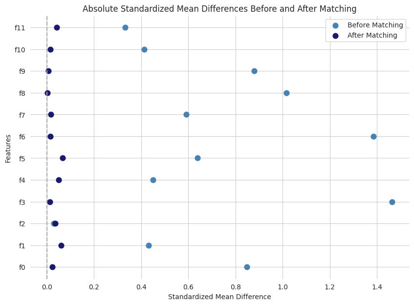

# Causal Inference for Targeted Advertising: A Propensity Score Matching Analysis

This project quantifies the causal effect of a targeted advertising campaign on user behavior. Utilizing the [Criteo Uplift dataset](https://www.kaggle.com/datasets/arashnic/uplift-modeling), we aim to estimate the impact of ad exposure on website visits and conversions, providing data-driven insights to optimize marketing strategies.

## Table of Contents

* [Introduction](#introduction)
* [Methodology](#methodology)
* [Key Findings](#key-findings)
* [Technologies Used](#technologies-used)
* [Key Assumptions](#key-assumptions)
* [Limitations](#limitations)
* [Future Work](#future-work)
* [Contact](#contact)
* [Acknowledgments](#acknowledgments)

## Introduction

In the realm of digital advertising, one size rarely fits all. Users respond differently to campaigns based on their individual characteristics and preferences. This project aims to uncover these nuanced responses by segmenting users and quantifying the heterogeneous treatment effects of a marketing campaign on user engagement (visits and conversions). By identifying which groups of users are most responsive, we can inform targeted advertising strategies and optimize resource allocation for maximum impact.

## Methodology

1.  **Exploratory Data Analysis (EDA):**  Explored the dataset to understand the distribution of features and outcomes, identifying potential confounding factors.

  

2.  **Feature Overlap Analysis:** Assessed the initial similarity between treatment and control groups across user features.

  

3.  **Propensity Score Matching (PSM):**  Used logistic regression to estimate propensity scores and nearest neighbor matching to create balanced treatment and control groups, reducing selection bias.

  

  

4.  **Causal Effect Estimation:**
    *   Calculated the Average Treatment Effect on the Treated (ATT) using simple difference-in-means.
    *   Used logistic regression with bootstrapping to estimate ATT, standard errors, and confidence intervals.

5.  **Heterogeneous Treatment Effects:**
    *   Applied Principal Component Analysis (PCA) to reduce feature dimensionality.
    *   Performed k-means clustering to identify distinct user segments.
    *   Estimated cluster-specific ATT using logistic regression.

  

  

## Key Findings

*   The ad campaign led to a statistically significant **26.8% uplift in site visits** and a **4.2% uplift in conversions**.
*   Identified **4 distinct user segments** with varying responsiveness to the campaign, enabling personalized targeting strategies.
*   Cluster 2, despite a lower baseline conversion rate, showed the highest uplift in conversions, highlighting the potential for targeted interventions.

## Technologies Used

*   **Programming Languages:** Python (pandas, numpy, scikit-learn, statsmodels)
*   **Causal Inference:** CausalML
*   **Data Visualization:** Matplotlib, Seaborn
*   **Statistical Modeling:** Logistic regression, bootstrapping
*   **Dimensionality Reduction:** PCA
*   **Clustering:** K-means

## Key Assumptions

*   **SUTVA:** Unit-level treatment effects are independent.
*   **Unconfoundedness:**  Treatment assignment is independent of potential outcomes after controlling for observed covariates.
*   **Overlap:** Non-zero probability of treatment for all units.
*   **Correct Propensity Score Model:** The logistic regression model is correctly specified.
*   **Consistency:** The observed outcome under treatment is the same as the potential outcome under treatment.

## Limitations

The Criteo dataset provides anonymized features (f0 to f11), which limits our ability to interpret the practical meaning of the principal components derived from PCA and the resulting user segments from clustering. While we can observe differences in behavior and treatment effects across clusters, the lack of feature descriptions hinders a deeper understanding of the underlying factors driving these differences.

## Future Work

*   Assess robustness to unmeasured confounding using sensitivity analysis.
*   Apply findings to real-world ad campaigns for validation and optimization. 
*   Incorporate additional data sources to enrich user profiles and improve segmentation.

## Contact

This analysis was conducted by Jasmine Kuo, a data scientist with a passion for leveraging analytics to address global challenges. For inquiries or collaboration, reach out via [Email](mailto:ik2437@nyu.edu) or [LinkedIn](https://www.linkedin.com/in/jasmineejkuo/).

## Acknowledgments

*   Criteo for providing the marketing campaign dataset.
